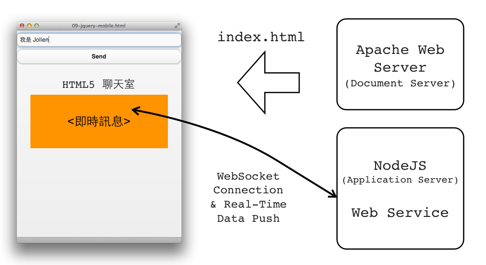

## 2.5 Data Push 設計模式

Data Push 的優勢，在於它能有效處理百萬級連線請求。原因很簡單：主動推送的架構讓 Server 掌握了節奏，使用者數量可以預先控制與分配。舉例來說，若同時在線的用戶超過 10 萬，可透過水平擴展（horizontal scaling）方式將負載分散。而在 Data Pull 架構下，使用者不定時發起的 Refresh 請求，會導致無法預測的流量暴衝。

Node.js 是實作 Data Push 的最佳工具之一。Server 使用 Node.js 架設 Web Server，資料經過封裝為 JSON，並透過 WebSocket 通道即時傳送至 Client 端。這就是 HTML5 時代下的「語意即時通訊」模式。

Data Push 的設計模式如圖 2.3 所示：

**步驟簡述如下：**

* Client 與 Server 建立 Persistent Connection（WebSocket）
* Server 記錄此連線狀態，作為語意路由節點
* 當 Server 有資料更新，透過 WebSocket 將資料推送（Push）至所有已連線的 Client
* Client 接收資料後，更新 HTML 內容或觸發 UI 重繪

這樣的結構雖然不複雜，卻代表 Web 應用正進入一種「反應式語境」：用戶不再主動發問，而是語言模型與伺服器主動說話。

### AJAX Refresh 重要性下降

AJAX 本質上是 Data Pull —— 用戶端定時詢問伺服器「你有沒有更新資料？」這樣的問句很頻繁，但不夠有效。這種頻繁的 Refresh 請求，會導致：

* Server 負載不可控
* 即時性不佳，資料總是延遲一拍

在 Real-time Web Application 的場景中，Data Pull 不再適合。AJAX 雖然能實作資料更新，但這種更新是被動、間歇式的，而非語意觸發下的即時行動。

更重要的是，在 Peak Time（尖峰時段），Server 可能突然收到大量 Client 請求，這種流量風暴將極度考驗系統的可用性與擴充性。

此外，Data Pull 模式也產生「Latency」問題。例如早期聊天室網站設計，必須使用者主動刷新頁面才能看到最新訊息，這種體驗遠遠不如現今的 Push-Based 架構。

Node.js + WebSocket 提供了一條語意主動推送的通路，Server 不僅能即時傳送資料，也能準確控制何時發送、發送給誰、發送什麼。

這並不代表 AJAX 完全失效。當設計「註冊帳號查詢」這類非即時、且具明確使用時機的功能時，AJAX 仍然是方便的工具。例如：使用者輸入帳號後，即時查詢該帳號是否存在，這是一個單次事件，適合用 Data Pull 處理。

真正的差別在於語意模式：

* **AJAX Refresh 模式**：不斷詢問（Polling），適合低頻資料查詢
* **Data Push 模式**：主動通知（Pushing），適合高頻、即時的語境溝通

實作 Real-time Web Application，Data Push 是核心設計原則。Node.js 正是這場語意即時架構變革的主角之一。

---

Next: [2.6 Device API 的革命時代](6-device-api.md)
