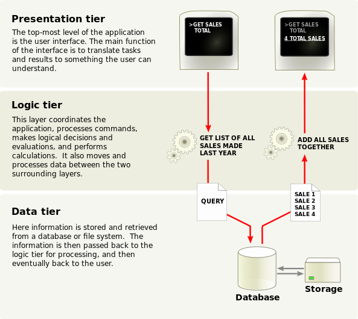

# 10.2 關於 SOA 與 3-Tier 架構

SOA（Service-Oriented Architecture）是一個熱門名詞，筆者認為，接下來幾年，它將成為 Web App 開發的主流架構。SOA 架構包含 Server 端，也就是 Web Service 的開發。

Node.js 是實作 Web Service 的優秀技術，因此成為 SOA 架構模式的熱門技術之一，許多新創公司紛紛選擇 Node.js 來開發創業作品。知名的團購網站 Groupon，不久前，[也宣佈將網站架構，轉移到 Node.js][3]。

[3]: https://engineering.groupon.com/2013/node-js/geekon-i-tier/ "Geekon: I-Tier"

要了解 SOA 的核心精神，就要由 SOA 的核心精神談起。SOA 本質上是一個軟體設計與架構的模式，也就是 SOA 是一個 Design Pattern。它主要被應用在 Web Service 軟體開發上，並且以 Event-Driven 的觀念，做為程式設計模式。

Event-Driven 的程式設計模式，與 Data-Driven 模式很像；Event-Driven 並不是 Procedure Programming（循序邏輯）的概念，它會比較偏向狀態機（State Machine）的程式邏輯。

實際上，State Machine 是 Event-Driven 的重要實作方法。Node.js + Express.js 開發者，如何引進 State Machine 的寫法呢？這部份後續再做討論。

### 3-Tier 架構

如何使用 SOA 設計模式，來架構 Web Service 呢？Web Service 的基礎建設，包含 Client 端與 Servier 端，在現在這個行動通訊裝置時代，Client 端也是 Device 端（設備端）。所以這個問題的答案並不難：採用典型的 Multi-Tier 架構。

Multi-Tier 架構又稱為 N-Tier 架構，最常見的就是 [3-Tier][4]，三層次架構。3-Tier 將 Web Service 的基礎建設，分為以下 3 層：

[4]: http://en.wikipedia.org/wiki/Multitier_architecture "Multitier architecture"

- Presenetation Tier
- Logic Tier
- Data Tier

Presentation Tier 是最上層的部份，也就是 User Interface。Logic Tier 進行邏輯處理與運算，例如：條件判斷、執行命令。Data Tier 負責儲存與讀取資料，資料儲放可使用資料庫，或一般的檔案系統。

3-Tier 架構是 Multi-Tier 架構的一種做法，除了 3 層式架構外，當然還有 4 層式，或是更多層的架構模式。3-Tier 架構的特色，就是把 Presentation Tier 與 Data Tier 完全隔離開來：

- Presentation Tier 無法直接與 Data Tier 溝通
- Logic Tier 負責處理 Data Tier 提供的資料，並搬移到 Presentation Tier

這個觀念，非常像 MVC（Model-View-Controller）設計模式，實際上 3-Tier 與 MVC 經常被混餚。但 3-Tier 與 MVC 最主要的差異，其實就是上面提到的 2 點。3-Tier 架構中，Presentation Tier 無法直接與 Data Tier 溝通；但 MVC 模式則具備此特性。

關於 MVC 模式的觀念，將在第 11 章，導入 Backbone.js 框架時，再為大家說明。

---

Next: [10.3 Presenetation 在 Client 端](3-use-middleware.md)
