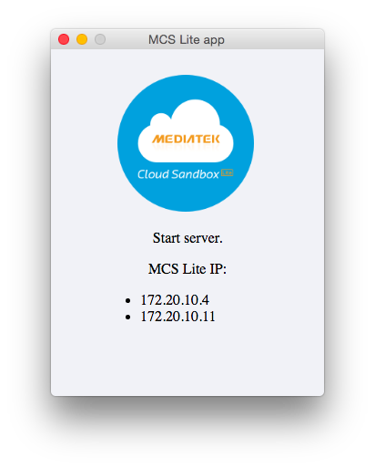

# 17.1 安裝 MCS Lite 私有雲環境


## Step 1：安裝 MCS Lite App

MCS Lite 是 MCS 的離線版本，可安裝在本地裝置，例如：支援 JavaScript 環境的 IoT 開發板、Notebook 或智慧型手機。MCS Lite App 是 MCS Lite 的 Desktop Application 套件，目前支援 Windows 64-bit 與 MacOS 64-bit 二個平台；下載位址分別如下：

* [MCS Lite App for MacOS X (64-bit)](http://s3-ap-southeast-1.amazonaws.com/mtk.linkit/mcs-lite-app/osx64.tar)
* [MCS Lite App for Windows (64-bit)](http://s3-ap-southeast-1.amazonaws.com/mtk.linkit/mcs-lite-app/win64.zip)

以下說明使用 MacOS X 環境。下載 [MCS Lite App for Windows (64-bit)](http://s3-ap-southeast-1.amazonaws.com/mtk.linkit/mcs-lite-app/win64.zip) 後，直接解壓縮並執行即可：

```
$ tar xvf ~/Downloads/osx64.tar
$ cd osx64/
$ open mcs-lite-app.app/
```

成功執行後，可以看到如圖 17.1 的畫面。



## 小結


