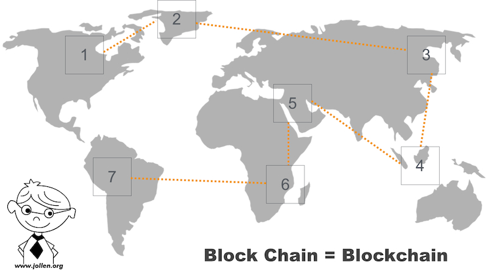
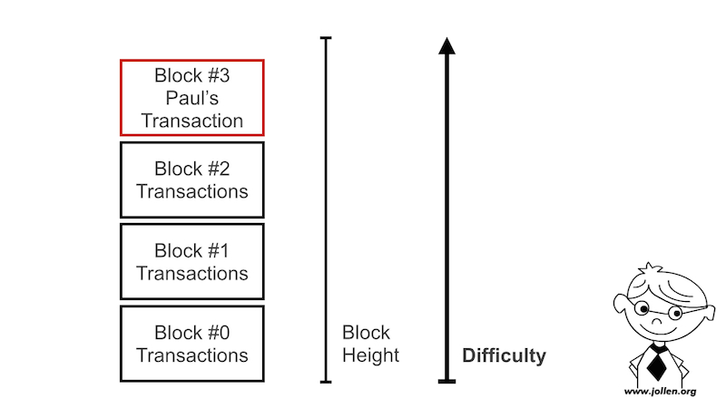
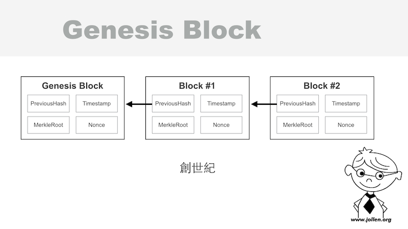

# 22.1 認識 Merkle Tree

Merkle tree 是一種 hash tree，用來表示 hash 值的資料結構。Merkle tree 的發明人是 [Ralph Merkle](https://en.wikipedia.org/wiki/Ralph_Merkle)，當然這就是這個資料結構的名稱由來。

Merkle tree 的基本結構是 binary tree（二元樹），每一個 non-leaf 的節點（node），都被標示一個 hash 值。

圖 22-1 就是一個 binary Merkle Tree 的結構。其中，*Top hash* 的部份，就是 *Merkle Root*。

圖 22-1 Merkle Tree（圖片來源：https://commons.wikimedia.org/wiki/File%3AHash_tree.png，By Davidgothberg at English Wikipedia，遵循 Public Domain 授權

學習 Merkle tree 資料結構，可以說是「Blockchain 系統開發者」的第 1 堂課。為什麼這麼說呢？

以圖 22-2 來看，分散（Distributed）在世界各地的所有 Block 之間，以一個鏈（Chain）的關係串連在一起，這就是 Blockchain（區塊鏈）的概念與名稱由來。

圖 22-2 Block 與 Chain

## Block #0

這些分散在世界各地的 Block，都會有一個編號，如圖 22-3。這個編號就是區塊產生的「順序」。

圖 22-3 Block #0

這其中，就一定會有編號為 0 的第一個區塊，這個區塊就稱之為 Genesis Block（創世區塊），學習如何建立 Genesis Block 就是 Blockchain 系統開發者的第 2 堂課。

而區塊的產生「方式」，則可以由 Blockchain 的系統開發者來設計。以 Nakamoto Blockchain 來說（Bitcoin 的 Blockchain 系統），區塊的產生過程，就稱為「挖礦」。

## Blockchain 與 Merkle Tree

那 Merkle Tree 是 Blockchain 的關係倒底是什麼呢？將 Blockchain、Genesis block 與 Merkle tree 放在一起討論時，它們的關係就是圖 22-4。

圖 22-4 Blockchain、Genesis block 與 Merkle tree

如果我發展一個叫做 Jollen's Blockchain 系統時，一個粗略的起步應該就是：

* 建立 Genesis block，genesis block 會有自已的一個 hash 值，這個值是經由 hash 演算法產生，因此也叫做 hash ID

* 利用演算法，經過一陣艱困的運算後，產生 Block #1

* Block #1 也會有自已的 hash ID，同時， Block #1 要使用 PreviousHash 欄位，串接到前一個 Block，它的前一個 Block 就是 Genesis block（Block #0）

* 同理，產生 Block #2 與更多 Blocks，這些 block 之間都用 *PreviousHash* 欄位串接，這條鏈就是 Block *chain*

到這邊，還是很好奇 Merkle tree 的用途啊？回顧圖 22-4 發現，每個 Block 裡面都會有 *Merkle Root* 欄位，這個欄位就是一顆 Merkle tree。

區塊倒底能做什麼呢？每一個區塊，都能用來「記帳」，整個 Blockchain 串接起來就是一本完整的帳冊，所以說，Blockchain 也叫做 distributed ledger（分散式帳冊）。

更深入技術來看，區塊裡的 Merkle tree 就是負責記帳的欄位。

