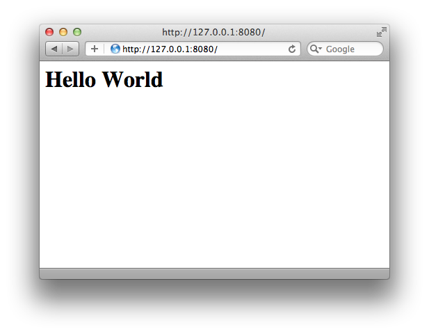

# Node.js 入門 - URL Routing 篇

HTML5 的學習，可分為二個層面：

- Frontend：即 Client（Device）端的開發
- Backend：即 Server（Cloud）的開發

這一章將從 Backend 開始整理重要的入門技術。通常 HTML5 的學習是由 Frontend 開始，而且是從最根本的 HTML5 標籤或 CSS 語法開始介紹。不過，從 Backend 的角度去看 Frontend，可以讓我們重新認識許多常見的 Frontend 技術。

筆者並不建議初學者，從 HTML5 標籤與 CSS 語法的角度來學習。現在的時空背景，與過去開發 Web 所使用的軟體技術已經有很大的差異了；因此，過去學習 Web 的觀念與方式，不太能適用於現在的 HTML5 軟體開發。

## 觀看 Nodejs 線上課程

這個章節將介紹 Node.js 技術，這是一個在 HTML5 領域裡非常重要的技術。 Node.js 並不是使用於 Client-side，如同先前所做的介紹，它使用於 Server-side。

接下來將會大家介紹的是 Node.js 的精神與技術哲學。本章節的寫作原則是著重「軟體思考」，關於技術上的細節不多加著墨。有關 Node.js  函數的說明，可參考 Node.js 官方網站。在繼續進行範例說明前，請先備妥這份文件：

http://nodejs.org/api/

另外，也請參考 Node.js 官方網站的說明，來安裝 Node.js 環境。關於環境安裝，以及 Node.js 的入門觀念，可參考由 MokoVersity 所提供的免費線上課程：

http://www.mokoversity.com/course/html5/nodejs-overview

### 取得上課範例

本章所撰寫的 Node.js 程式碼，皆可在 Github 上取得：

https://github.com/jollen/html5-websocket-nodejs

接下來，讓我們用一個連貫性的實例：即時通訊軟體，來為大家介紹 Node.js 技術。

## 第一個 Node.js 程式

我們提過了， Node.js 就是 Web Server。所以，不免俗地先了解 "Hello, World" 的寫法：

{title="01-create-server/hello.js"}
~~~~~~~~
 1 var http = require('http');
 2 
 3 var httpServer = http.createServer(function (req, res) {
 4   res.writeHead(200, {'Content-Type': 'text/html'});
 5   res.end('<h1>Hello World</h1>\n');
 6 });
 7 
 8 httpServer.listen(8080);
 9 
10 console.log('Server running at http://127.0.0.1:8080/');
~~~~~~~~

程式碼第 3 行的地方，呼叫 http 模組的 createServer() 函數來建立一個 Web Server 物件。建立 Web Server 物件，並且啟動一個 Web Server，是  Node.js  技術的第一個步驟。

createServer()函數的說明如下：

~~~~~~~~
http.createServer([requestListener])
~~~~~~~~

createServer() 執行成功後傳回 Web Server 物件，參數 requestListener 是一個 Request Handler Function，用來處理 request 事件。關於 Node.js 的事件處理技術，後續再做說明。當 request 事件發生時，Request Handler Function 將被 Callback，並帶有二個參數：

- req：http.ServerRequest的實例化(instance)
- res：http.ServerResponse的實例化

將上述的範例，儲存為 hello.js，並且利用 node 指令執行：

$ node hello.js 

安裝 Node.js 後，就可以取得 node 命令。

這是執行 Node.js 程式碼的陽春版做法，後續將導入 forever 工具，以進階的方式來執行 Node.js 程式。

 Node.js 採用 Google 所開發的 V8 JavaScript 引擎，原本 V8 引擎是設計給瀏覽器使用的 JavaScript 引擎，現在有開發者把它抽離出來，變成一個獨立的直譯器，讓 JavaScript 程式碼升格為 Server-Side Script。

我們利用瀏覽器連到 http://127.0.0.1:1234/，結果如圖 3.1。

### V8 JavaScript引擎介紹

JavaScript 引擎將成為手持裝置的重要技術。早期的 Android 系統，使用的 JavaScript 引擎稱為 JavaScriptCore (JSC)，這是由 Apple 所開發的 JavaScript 引擎，並且包含在 Webkit 中。因為一些原因，Google 也決定開發自已的 JavaScript 引擎，稱之為 V8。

技術上，JSC 與 V8 的設計理念不同，一般相信，新一代的 V8 引擎效能比 JSC 引擎更好。Android 2.3 加入了 V8 引擎，若想使用最近的 V8 引擎，就要使用 Android 2.3 以上的版本。

### 為什麼要使用 Node.js？

到這裡，大家可能會有一個疑問。為什麼不使用現有的 Web Server 來開發 Web Service 就好，例如使用 Apache。非要使用 Node.js 技術不可嗎？這個問題的答案，要從 Thread Model 說起。

典型的 Web Server 以 Multi-thread 架構來實作「Concurrency」，也就是以建立 Thread 的方式，來處理處理事件（Events）。但是過多的 Thread 會造成伺服器的負擔：

- 假設一個 Thread 可以處理 10 個事件
- 同時處理 1000 個事件，就必須建立 100 個 Thread
- 大量的 Thread 在分時作業系統裡，會造成 Context-Switch Overhead，讓每一個 Thread 處理事件的時間拉長，形成效能低落的現象

由此可知:

- 若是將 Multi-thread 架構，應用在「處理巨量的同時連線請求」上，伺服器的負擔就會很大
- Multi-thread 架構的軟體，可能在系統產生過多的 Thread，過多的 Thread 除造成伺服器的負載增加外，也需要大量的記憶體

是否有替代方案呢？將上述的 Multi-thread 架構，改為 Event Loop 架構即可。Node.js 的訴求之一就是：採用 Event Loop 架構。此外，Node.js 採用 JavaScript 程式語言，JavaScript 本身也有一些很好的語言特性：

- 具備 Lambda 運算子，大量使用暱名函數（anonymous function）與 Closure（封閉性）觀念
- 使用 Callback Object 做為函數的參數（Lambda），易於處理 Non-blocking Operation 與 Event Handling

Node.js 本身的 I/O 操作，也大多是（幾乎）Non-blocking 的機制。這點與 PHP 有很大的不同。這樣的機制，對於消化巨量的連線請求，有非常大的幫助。

## 製作 Node.js 模組

學習 Node.js 的第一件事情，就是了解如何將程式碼模組化，簡單來說，就是製作一個程式庫 Node.js 的模組隱含著 Closure 的特性，這與第一章介紹的觀念相同（但做法不同）。

JavaScript 比較講求模組化，所以我們繼續重構 hello.js。先將 Web Server 的部份獨立成一個模組，程式碼規劃如下：

- index.js：主程式
- server.js：啟動Web server的模組

index.js的完整程式碼如下：

{title="02-modules/hello.js"}
~~~~~~~~
var server = require("./server");

server.start();
~~~~~~~~

主程式的部份，以 require() 函數將 server 模組（即 server.js 檔案）引入，接著呼叫模組裡的 start() 函數。server.js 完整程式碼如下：

{title="02-modules/server.js"}
~~~~~~~~
 1 var http = require("http");
 2 
 3 function start() {
 4   function onRequest(request, response) {
 5     console.log("Request for " + pathname + " received.");
 6 
 7     response.writeHead(200, {"Content-Type": "text/plain"});
 8     response.write("Hello World");
 9     response.end();
10   }
11 
12   http.createServer(onRequest).listen(8080);
13   console.log("Server has started.");
14 }
15 
16 // Export functions
17 exports.start = start;
~~~~~~~~

程式碼第 3 行到第 16 行的地方，我們實作了一個函數，並且將它匯出。請特別留意，沒有匯出的函數，將不是 Public，它不能被外部的人呼叫。exports 是 Node.js 的一個 Global object，用來讓我們匯出模組裡的函數，成為 Public Function。

目前為止，我們發現了一些觀念：

- Frontend 與 Backend 都使用 JavaScript 做為主要的程式語言
- Frontend 與 Backend 都要模組化，並引入 Closure 觀念
- Frontend 與 Backend 的 Module / Closure，相念相通，實作方式不同

### Chaining Pattern

另外，server.js 裡也做了一些改寫。程式碼第 4 行的地方，以具名函數的方式重新實作，目的是讓程式碼更具可維護性。此外，程式碼第 14 行的地方：

~~~~~~~~
http.createServer(onRequest).listen(8080);
~~~~~~~~

物件接著下一個物件來連續呼叫多個方法的寫法，就叫 Chaining Pattern（鏈接模式）。這個設計模式的目的，同樣是為了提升程式碼的可維護性：不但能簡化程式碼，更能讓程式碼能構成一個句子。

在接下來的範例裡，我們將善用具名函數以及 Chaining Pattern 來提昇程式碼的可維護性。

## URL Routing

這是處理 URL（HTTP Request）與 Query String 的核心觀念，這是利用 Node.js 開發 Web Service 的重要步驟。讓我們先來了解 Routing 的寫法，再來探討它的觀念。

首先，先改寫 server.js 模組如下：

{title="03-route/server.js"}
~~~~~~~~
 1 var http = require("http");
 2 var url = require("url");
 3 
 4 function start(route) {
 5   function onRequest(request, response) {
 6     var pathname = url.parse(request.url).pathname;
 7     console.log("Request for " + pathname + " received.");
 8     console.log("Request url: " + request.url);
 9 
10     route(pathname);
11 
12     response.writeHead(200, {"Content-Type": "text/plain"});
13     response.write("Hello World");
14     response.end();
15   }
16 
17   http.createServer(onRequest).listen(8888);
18   console.log("Server has started.");
19 }
20 
21 // Export functions
22 exports.start = start;
~~~~~~~~

Routing 觀念的主要用途是處理 URL，所以我們利用 url 模組來取出 URL 裡的 pathname，並將 pathname 交給 route() 函數來處理。這裡很特別的地方是，start() 函數裡所呼叫的 route()函數，是透過參數列傳遞進來的，這和模組的 Closure 特性有關係，觀念說明如下：

- route() 函數實作在 router 模組，而不是 server.js 模組
- 目的是將 Routing 的功能，拆成單獨的模組來維護
- route() 函數由 router.js 模組提供，必須引用 router 模組

在這裡範例裡，我們由 index.js 引入 router.js 模組，並且將裡頭的 router() 函數，透過參數列交給 start()函數。如此一來，start() 也可以呼叫到 route() 函數了。

這個部份，可以選擇另外一個實作方法：在 server.js 裡引用 router.js 模組。不過，就概念上來說，範例的實作方式好一些。原因如下。

- Decompostion：將 router.js 與 server.js 模組的相依性解除
- Component-based software engineering：將 router.js 與 server.js 做成獨立的模組，他們之間如果沒有相依性，就可以做為二個不同的模組來使用。例如，將 router.js 模組抽換成其它專案的 Routing 模組，並且 server.js 可以重用。Node.js 的軟體架構，主軸是模組化，即 Component-based 軟體工程的觀念

目前透過 npm 指令，不但可以安裝到各式不同的 Node.js 模組，甚致可以將自已的模組出版（Publish）給其他開發者使用。

Node.js 的事件處理機制，採用典型的 Callback Functions 做法。

接著，要開始處理 Pathname 與 Query String 的解析，請先參考圖 2.2。

改寫 index.js 主程式如下：

{title="03-route/index.js"}
~~~~~~~~
1 var server = require("./server");
2 var router = require("./router");
3 
4 server.start(router.route);   // 傳遞route物件
~~~~~~~~

將 Routing 的演算法製作成獨立的模組，並將 router() 函數傳遞給 start()，函數的參數，可以傳遞一個函數，這個觀念就是 Lambda。router.js 完整程式碼如下：

{title="03-route/router.js"}
~~~~~~~~
1 function route(pathname) {
2     console.log("Route this request: " + pathname);
3 }
4 
5 exports.route = route;
~~~~~~~~

請注意，這個範例雖然陽春，但是展示了一個非常重要的觀念：

- 函數就是物件，所以我們把 *route* 物件交給 start() 函數，讓 start() 函數去使用物件
- 直接在 start() 裡呼叫 route() 函數也可以，為什麼不這樣做？因為這不是 JavaScript 的觀念，倒是有點像是標準 C 語言呼叫函數的觀念，同時也會降低程式碼的可維護性

接下來，要讓 route() 解析 pathname。例如，我們定義了二個 API：

- http://localhost:8080/start，用來連接伺服器並接收即時訊息
- http://localhost:8080/send，送出文字訊息

分別要處理二個 pathname 如下：

- /start，呼叫專屬的 Handler 'start()' 來處理
- /send，呼叫專屬的 Handler 'send()' 來處理

實作的關鍵來了，我們要利用 Request Handler 的觀念來實作，首先，修改 index.js 如下：

{title="04-request-handlers/index.js"}
~~~~~~~~
 1 var server = require("./server");
 2 var router = require("./router");
 3 var handlers = require("./requestHandlers");
 4 
 5 // 使用 Object 來對應 pathname 與 request handlers
 6 var req = {
 7    "/": handlers.start,
 8    "/start": handlers.start,
 9    "/send": handlers.send
10 };
11 
12 // 傳遞 request handler 
13 server.start(router.route, req);
~~~~~~~~

上述的二個 Handler 函數：start() 與 send() 將另行實作於 requestHandlers 模組。requestHandlers 模組匯出 start() 與 send() 函數，分別處理相對應的 pathname。

因此，主程式在第 6 行到第 10 行的地方，利用 *req* 物件來對應這個關係。在呼叫 start() 時，將 req 物件傳入。

另外，JavaScript 雖然不是物件導向式語言，但仍要以物件的觀念來撰寫。所以，我們將 *req* 以 var 語法定義成 object。很多時候，或許也能以 associative array 來實作，但並不是很建議。

以下就是一個以 associative array 的實作範例，原則上不推薦：

~~~~~~~~
 1 var server = require("./server");
 2 var router = require("./router");
 3 var handlers = require("./requestHandlers");
 4 
 5 // 使用 associative array 來對應 pathname 與 request handlers
 6 var req = {};
 7
 8 req["/"] = handlers.start;
 9 req["/start"] = handlers.start;
10 req["/send"] = handlers.upload;
11 
12 // 傳遞 request handler 
13 server.start(router.route, req);
~~~~~~~~

修改後的 router.js 如下：

{title="04-request-handlers/router.js"}
~~~~~~~~
 1 function route(pathname, handlers, response) {
 2     console.log("Route this request: '" + pathname + "'");
 3 
 4     // 檢查 pathname 是否有對應的 request handlers
 5     if (typeof handlers[pathname] == "function") {
 6         handlers[pathname](response);
 7     } else {
 8         console.log("No request handler for this pathname: '" + pathname + "'");
 9     }
10 }
11 
12 exports.route = route;
~~~~~~~~

再次修改 server.js 如下：

{title="04-request-handlers/server.js"}
~~~~~~~~
 1 var http = require("http");
 2 var url = require("url");
 3 
 4 function start(route, handlers) {
 5   function onRequest(request, response) {
 6     var pathname = url.parse(request.url).pathname;
 7     console.log("Request for " + pathname + " received.");
 8 
 9     route(pathname, handlers, response);
10 
11     response.writeHead(200, {"Content-Type": "text/plain"});
12     response.write("Hello World");
13     response.end();
14   }
15 
16   http.createServer(onRequest).listen(8080);
17   console.log("Server has started.");
18 }
19 
20 // Export functions
21 exports.start = start;
~~~~~~~~

最重要的模組：requestHandlers.js，完整程式碼如下：

{title="04-request-handlers/requestHandlers.js"}
~~~~~~~~
 1 function start(response) {
 2     console.log("Handler 'start' is started.");
 3 }
 4 
 5 function send(response) {
 6     console.log("Handler 'send' is started.");
 7 }
 8 
 9 exports.start = start;
10 exports.send = send;
~~~~~~~~

到這裡，已經完成了一份很基本的 Web Service 實作。接下來，我們要將這個成果發展成一個即時聊天軟體，就命名為 NoChat。NoChat 將會是一個完全使用 HTML5 技術開發的即時聊天軟體。

## 設計 HTTP API

完整的 NoChat 分為二個部份：

- Backend（Server-side）將基於目前的 Node.js 程式碼繼續完善
- Frontend（Client-side）手機端的 App 將以 HTML5 + PhoneGap 來製作

NoChat 提供二個API，現在將 API 詳細定義如下。

- /start，建立與 Client 的 WebSocket 連線
- /send，送出訊息。

'/send' API 的 Query String 參數定義如表 3-1。這部份在第 2 章已做過說明。

{title="表 3-1 API 的參數"}
|參數    |值       |用途說明      
|-------|---------|--------------
|m      |'hello'  | 指定要傳送的訊息 (message)
|u      |'jollen' | 指定 Username

### 測試案例

以下設計一個簡單的測試案例，在完成第一個 NoChat 的 Prototype 後，將以下列步驟進行測試：

1. 在 localhost 啟動 Node.js

2. 打開 client.html 聊天網頁

3. client.html 呼叫 API：http://localhost:8080/start，Server 回傳 "OK" 訊息

4. client.html 與 Server 建立 WebSocket 連線

5. clieht.html 開始接收 Node.js 推送（Data Push）的即時訊息

傳送訊息給 Node.js 的測試步驟：

1. 開啟一個新的瀏覽器視窗

2. 使用瀏覽器呼叫 API：http://localhost:8080/send?m=hello

3. Node.js 收到訊息，並透過 WebSocket 將訊息 Push 給所有的用戶端

這還不算是一個真正的使用案例(Use Case)，但至少可以幫助我們實作出第一個Prototype。

### 關於 Web Service

圖 2.2 是大家所熟悉的 HTTP API 形式。許多網站，像是：Google、Facebook 等，都有開放 HTTP API 供開發者存取它們的服務。以 NoChat 來說，透過上述二個 API 可以向 Server 請求服務。因此，Node.js 的重心，就是在發展 Web Service。

Web Service 的 API 定義，未來將重構為 REST 標準。基於 HTTP 的 Web Service API，是目前為止，我們所學到的重要觀念。

此外，呼叫 HTTP API 的方式，可使用 GET 與 POST 二種 HTTP 方式（HTTP Method），這二種方式都是定義在 HTTP 裡的標準。REST 標準，也引用了其它的 HTTP Method。

目前，NoChat 仍暫時以 Query String 的方式來傳遞參數。

## 解析 Query String

Client 端呼叫 Server 所提供的 Web Service API。所以，現在的關鍵是如何解析 Query String。如圖 2.2，Node.js 使用 querystring 模組來解析 Query String。先將 querystring 模組匯入，接著呼叫 parse() 函數：

~~~~~~~~
var querystring = require('querystring'); 
var parsedstring = querystring.parse(“m=helll&u=jollen”); 
~~~~~~~~

解析後的結果存放於 parsedstring 物件，回傳結果：

~~~~~~~~
{ m: 'hello', u: 'jollen' } 
~~~~~~~~

parse() 函數有三個參數：

~~~~~~~~
querystring.parse(str, [sep], [eq])
~~~~~~~~

- str 是 Query String
- sep 是「Separator」，也就是字串的分隔字元，預設是 '$'，通常不做變數
- eq 則是字串與值的對應字元，預設是 '='，通常不做變數

了解如何解析 Query String 後，就可以開始進行後續的工程了。再次修改 requestHandlers.js，如下：

{title="05-query-string/requestHandlers.js"}
~~~~~~~~
 1 var querystring = require('querystring'); 
 2 
 3 /**
 4  * Global variables
 5  */
 6 var history = [ ];
 7 
 8 function start(response, query) {
 9     console.log("Handler 'start' is started.");
10     console.log("Query string is: " + query);
11 }
12 
13 function send(response, query) {
14     console.log("Handler 'send' is started.");
15     console.log("Query string is: " + query);
16 
17     var parsedstring = querystring.parse(query); 
18 
19     var obj = {
20         message: parsedstring.m,
21         username: parsedstring.u,
22         timestamp: (new Date()).getTime()
23     };
24 
25     history.push(obj);
26 
27     //////// DEBUG ////////
28     for (var i = 0; i < history.length; i++) {
29         console.log("["+i+"]: " + history[i].message);
30     }
31 }
32 
33 exports.start = start;
34 exports.send = send;
~~~~~~~~

這裡利用一個全域陣列 *history* 來儲存訊息。將收到的訊息封裝成物件後， 再使用標準的陣列操作將物件放到陣列裡。另外，我們也將一個時間記號（Timestamp）一併封裝至該物件，用來紀錄接收到訊息的時間。

## 結論

到這裡完成了 Node.js 入門的學習：

- 學會撰寫第一個 Node.js 程式
- 學會啟動 HTTP Server
- 了解並實作 URL Routing
- 學會解析 Pathname 與 Query String

