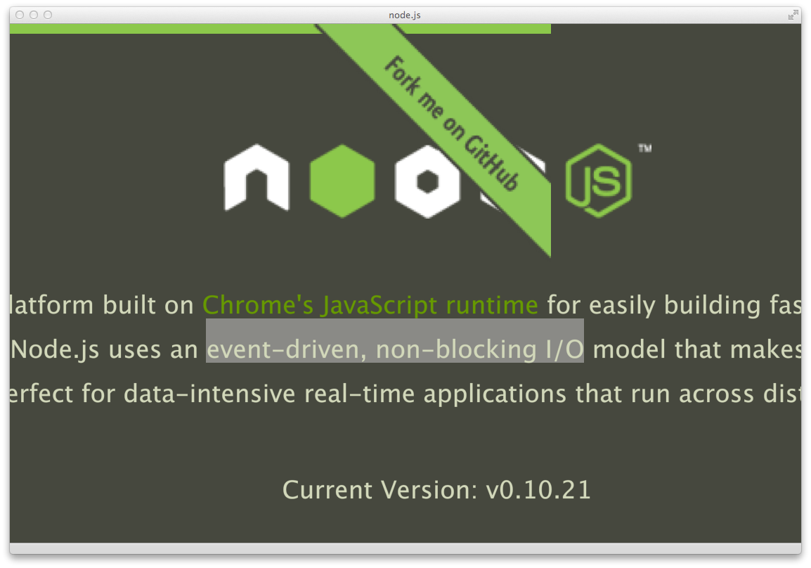

# 軟體思惟 - Non-blocking IO 篇

要繼續深入 Node.js 開發，許多 Node.js 的觀念必須陸續建立起來。對初學者來說，最重要的莫過於 Non-blocking IO 的觀念。

Node.js 的網站上，以精簡的 2 個特色來說明其技術特色：

- Event-driven
- Non-blocking IO

第一個特色，在第 1 章做過介紹，以 Event Loop（Event-driven）的觀念來取代 Multi-thread。第二個特色，則是 Node.js 最重要的技術。要了解 Non-blocking IO 的觀念，只要練習做一個題目即可：檔案讀取。

用 Node.js 撰寫二個範例：

- 讀取一個檔案
- 讀取多個檔案

看似簡單的二個題目，思惟邏輯卻經常困擾 Node.js 的新手，特別是從 C/PHP/Java 語言，進入 Node.js 程式設計的初學者。

範例程式可由 Github 取得：

https://github.com/jollen/nodejs-readfile

再繼續進行前，大家不妨使用 C/PHP/Java 任何一個語言，撰寫「讀取多個檔案」的程式，並搭配本章的範例，進行觀念的探討。

## Node.js File System

Node.js 提供 File System 模組，支援檔案的讀取等功能。參考 Node.js 的 API 手冊，找到 [*fs.readFile()* 函數][1]：

~~~~~~~~
fs.readFile(filename, [options], callback)
~~~~~~~~

*readFile()* 的第三個參數，是一個 Callback Function，這就是第 5 章所介紹的 Lambda 觀念。為什麼要傳遞 Callback Function 做為參數呢？這要從 Non-blocking IO 的觀念說起。

[1]: http://nodejs.org/api/fs.html#fs_fs_readfile_filename_options_callback

典型的 C/PHP/Java 語言，都支援同步式的 File System 操作。例如，從 C/PHP/Java 語言進到 Node.js 開發的初學者，可能會寫出這段程式碼邏輯：

~~~~~~~~
fs.readFile('hello.txt', data);
console.log(data);
~~~~~~~~

請注意，這只是一段虛擬碼，並不能執行。這段虛擬碼的想法如下：

- 呼叫 readFile() 來讀取 'hello.txt' 檔案
- 讀取的內容放到 *data* 變數
- 然後將 *data* 變數的內容（檔案內容）送出

這是一個循序邏輯（Procedure）的觀念。Node.js 的 *readfile()* 是非同步式操作，也就是 Non-blocking IO 的觀念。Node.js 並不會等到 *readFile()* 完成工作後，「才繼續往下執行」，而是「立即往下一行執行」。

也就是說，當下一行執行時，*readFile()* 可能還在讀取 'hello.txt' 檔案。所以 *console.log()* 不一定能印出完整內容。*data* 變數也有可能是空的。

Node.js 的特色是支援 Non-blocking IO：它不會等到 IO 完成後，才往下執行。所以，完成檔案讀取時，很可能程式碼已經執行到非常後面了。要如何知道檔案已讀取完成呢？*readFile()* 完成工作後，就會 Callback 我們指定的函數。如此一來，就知道檔案已經讀取完成了。

正確的程式實作如下：

~~~~~~~~
var fs = require('fs');

fs.readFile(filename, 'utf8', function(err, data) {
    console.log("[DATA] " + data);
});
~~~~~~~~

Callback Function 是一個暱名函數（Lambda），當它被呼叫時，表示已完成檔案讀取，並且收到二個參數。根據 Node.js 的手冊，第二個參數存放讀取到的內容。

了解 Non-blocking IO 的觀念後，就會知道以下是一個錯誤寫法：

~~~~~~~~
var fs = require('fs');

fs.readFile(filename, 'utf8', function(err, data) {
});

console.log("[DATA] " + data);  // 錯誤寫法
~~~~~~~~

這就是 Node.js 最重要的觀念：Non-blocking IO，實作上，搭配 Callback Function 的觀念。

## 讀取多個檔案

以上是讀取一個檔案的範例。現在，讓我們來改寫程式：

- 讀取 index.txt 檔案，index.txt 列出多個文字檔
- 再讀取 index.txt 裡列出的檔案

例如，index.txt 的內容如下：

~~~~~~~~
chapter1.txt
chapter2.txt
chapter3.txt
chapter4.txt
chapter5.txt
~~~~~~~~

再分別去讀取上述共 5 個檔案的內容。撰寫這個練習題，要先分析幾個觀念：

- 以 Line-by-Line 方式讀取 index.txt
- 讀取 index.txt 的動作，是 Non-blocking IO
- 等到 index.txt 讀取完成後，再開始讀取其它檔案
- 如上，在 Callback Function 裡，撰寫「讀取其它檔案」的程式碼

有一個 Node.js 的模組：Node-BufferedReader，可以協助我們做 Line-by-Line 的讀取。必須先安裝這個模組：

$ npm i buffered-reader

用法如下：

~~~~~~~~
 1 var reader = require ("buffered-reader");
 2 var DataReader = reader.DataReader;
 3 
 4 new DataReader ('index.txt', { encoding: "utf8" })
 5     .on ("error", function (error){
 6         console.log(error);
 7     })
 8     .on ("line", function (line, nextByteOffset){
 9         console.log("[LINE] " + line);
10     })
11     .on ("end", function (){
12         // finish reading
13     })
14     .read();
~~~~~~~~

*buffered-reader* 會逐行讀取 'index.txt'，完成單行讀取後，觸發 *line* 事件，並 Callback 一個函數。這部份實作在第 8 行，Callback Function 的第一個參數 *line* 存放讀取到的內容。

接著，將檔名儲存到陣列裡備用：

~~~~~~~~
 1 // the file list
 2 var files = [];
 3 
 4 new DataReader (path + 'index.txt', { encoding: "utf8" })
 5     .on ("error", function (error){
 6         console.log (error);
 7     })
 8     .on ("line", function (line, nextByteOffset){
 9         files.push({
10             filename: line
11         });
12     })
13     .on ("end", function (){
14         // finish reading
15     })
16     .read();
~~~~~~~~

要如何讀取 *files* 陣列裡的檔案呢？只要撰寫一個迴圈即可：

~~~~~~~~
1 for (var i = 0; i < files.length; i++) {
2 	var filename = files[i].filename;
3 
4     fs.readFile(filename, 'utf8', function(err, data) {
5 	    console.log("[DATA] " + data);
6 	});
7 }
~~~~~~~~

這段程式碼，是本章的另一個重點：

- 第 4 行是 Non-blocking IO
- 所以不會等到 *readFile()* 讀完檔案，會立即往下執行，進入下一個迴圈

這個迴圈並不會因為「讀取檔案」，而花費太多的執行時間，這就是 Node.js 能做到「efficient」與「real-time」的關鍵。完整的程式碼如下：

{title="readfile.js"}
~~~~~~~~
 1 // public modules
 2 var util = require('util');
 3 var fs = require('fs');
 4 var reader = require ("buffered-reader");
 5 var DataReader = reader.DataReader;
 6 
 7 // the file list
 8 var files = [];
 9 
10 /**
11  * Use BufferedReader to read text file line by line.
12  *
13  * See: https://github.com/Gagle/Node-BufferedReader
14  */
15 var getFilelist = function(path, cb) {
16     new DataReader (path + 'index.txt', { encoding: "utf8" })
17         .on ("error", function (error){
18             console.log (error);
19         })
20         .on ("line", function (line, nextByteOffset){
21             files.push({
22                 filename: line
23             });
24         })
25         .on ("end", function (){
26             cb(files);
27         })
28         .read();
29 };
30 
31 // Application
32 getFilelist('manuscript/', function(files) {
33     for (var i = 0; i < files.length; i++) {
34     	var filename = 'manuscript/' + files[i].filename;
35 
36         fs.readFile(filename, 'utf8', function(err, data) {
37     	    console.log("[DATA] " + data);
38     	});
39     }
40 });
~~~~~~~~

以下是執行結果：

~~~~~~~~
[DATA] This is chapter 1.

[DATA] This is chapter 2.

[DATA] This is chapter 3.

[DATA] This is chapter 4.

[DATA] This is chapter 5.

~~~~~~~~

要特別注意的是，上述的訊息順序是「非確定性」。由於 *readFile* 是 Non-blocking IO，所以「先讀取的檔案」，不一定「先完成讀取」。例如，'chapter1.txt' 的檔案很大時，就可能比其它後續的檔案，更晚完成讀取。

## 結論

根據筆者的教學觀察，Non-blocking IO 與 Callback Function 的觀念，是原本 C/PHP/Java 程式設計者，跨入 Node.js 開發的一個障礙。要克服這個障礙，就要建立 Non-blocking IO 的觀念，並訓練程式設計邏輯。這和 Procedure 式的執行行為有很大的不同。

Non-blocking 的觀念，也稱做 Wait-free。利用 Wait-free 的觀念來實作 Web Service 的話，可以達到較佳的 Concurrency 處理能力；例如：提昇「Requests per Second」，增進 Server 的處理性能。
